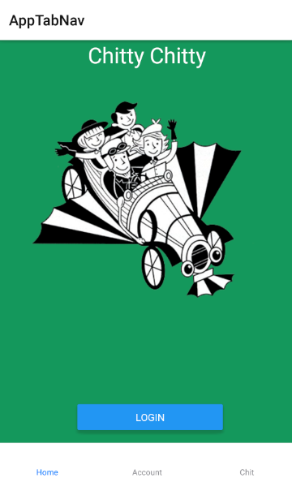

# Chittr

Chittr is a mobile application developed using React Native. The aim of the application is to create a new form of social media. Like twitter, users can post chits and the entire application is mobile.
The application has a login page, and a account creation page. The application also contains a chit feed, which shows all users chits. The application also allows users to follow other users and unfollow users. Features that have been recently added include being able to search for users

## Visuals


## Installation

```bash
npm install react-navigation
npm install react-navigation-stack
npm install react-navigation-tabs
npm install @react-native-community/async-storage
npm install react-native-geolocation-service
```
## Roadmap

Releases in the future will contain being able to set User Profile photo
It will also contain being able to post chits that contain camera images.

## Author and acknowledgment

Tazzzzzz
